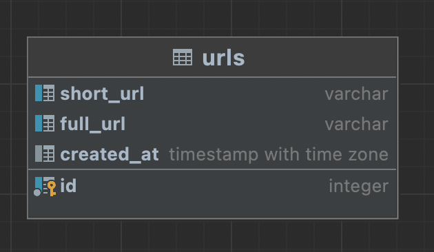

# UrlShortener service
Description: it's mini service for shortening url into hash with `maxLength = 10`

---

### For architecture was used the light version uncle Bob's clean code
it means the flow of process in service goes through 3 layers:
1. Controller - layer of handlers
2. Service - layer of business login
3. Repository - process with database

The main settings of service are located in `settings.json` file. Also
logs are divided into 4 types for more comfort analise:
1. `info.log`
2. `warning.log`
3. `error.log`
4. `debug.log`

Routes are documented by using swagger 2.0. Documentation is available with URL below:
[click here](https://shortenertj.herokuapp.com/swagger/index.html#)
---
### For db was decided to use Postgres
Because it's much safer to store data into hardware then in ram. For instance
if we suddenly restart the server, it's ram will be also restarted, and we'll 
lose our data

In postgres we have just one table `url` where we will store out shorten urls

---
Service is now deployed on heroku. And is available by the link below
[click here](https://shortenertj.herokuapp.com)

